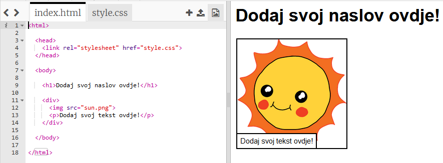
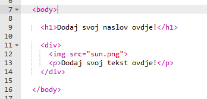
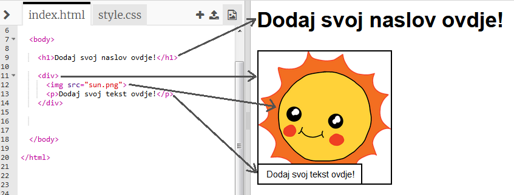

## Uređivanje priče

Započnimo sa uređivanjem HTML sadržaja i CSS stila veb-stranice.

+ Otvori [ovaj trinket](http://jumpto.cc/web-story){:target="_blank"}.

Projekat treba da izgleda ovako:

Sadržaj veb-stranice nalazi se u odjeljku `<body>` u `index.html` HTML dokumenta.

+ Nađi sadržaj veb-stranice od 7. reda nadalje, unutar oznaka `<body>` i `</body>`.

+ Pokušaj da otkriješ koje oznake se koriste za kreiranje različitih dijelova veb-stranice.

## \--- collapse \---

## title: Odgovor

+ `<h1>` je **heading** (naslov). Za kreiranje naslova različitih veličina možeš da koristiš brojeve od 1 do 6.
+ `
` is short for **division**, and is a way of grouping stuff together. In this webpage, you'll use it to group together all the stuff for each part of your story.
+ `` is an **image**.
+ `
` is a **paragraph** of text.

\--- /collapse \---