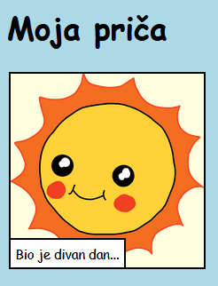

\--- challenge \---

## Izazov: napravi nekoliko izmjena

Uredi HTML kôd i CSS kôd da prilagodiš veb-stranicu svojim željama.

HTML sadržaj nalazi se u `index.html` datoteci, a CSS stil u `style.css` datoteci.

Možeš da promijeniš boje na veb-stranici, a možeš i da koristiš različite fontove kao što su:

+ Arial
+ Comic Sans MS
+ Impact
+ Tahoma

Više CSS naziva boja možeš naći [ovdje](http://jumpto.cc/colours){:target="_blank"}.

\--- /challenge \---