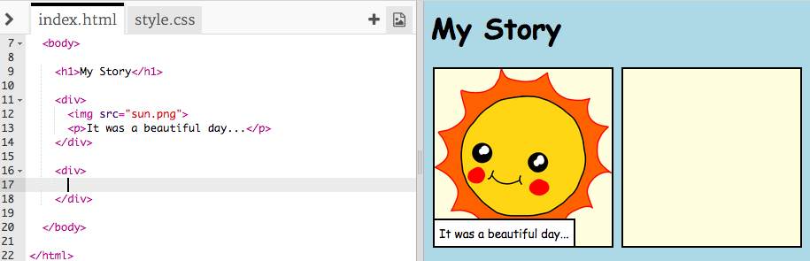

## Pričanje priče

Dodajmo drugi dio priče.

+ Idi u 15. red kôda i dodaj još jedan par oznaka, početnu `<div>` i završnu `</div>`. Tako ćeš kreirati novo polje za sljedeći dio tvoje priče.



+ Dodaj pasus teksta unutar svoje nove `<div>` oznake:

```html
<p>Još teksta ovdje!</p>
```


+ U svoje novo polje možeš da dodaš i sliku tako što ćeš dodati sljedeći kôd unutar oznake `<div>`:

```html

```


Primijeti da su oznake `` malo drugačije od ostalih oznaka: nemaju završnu oznaku.

+ To get an image to show up, you need to add the **source** (`src`) of the image inside the speech marks.

Click the image icon to see the images available for your story.


+ Decide which image you want to add and remember its name, for example `buildings.png`.

+ Click on `index.html` to get back to your code.


+ Add the name of the image between the speech marks in your `` tag.

```html

```

