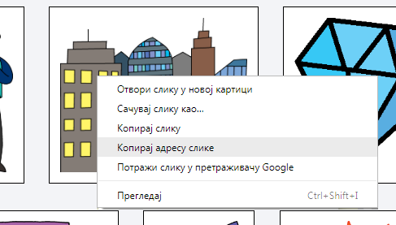
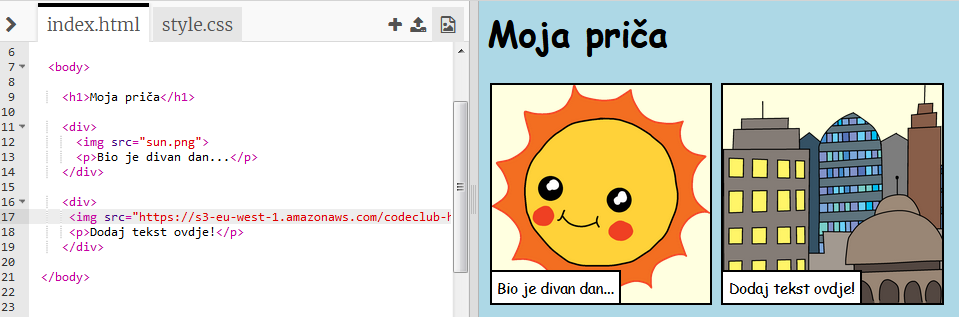

## Pronalaženje sopstvenih slika

Pronađimo na internetu sliku koju ćemo dodati u tvoju priču.

+ Idi na [ovu stranicu](http://jumpto.cc/html-images){:target="_blank"} i pronađi sliku koju želiš da dodaš u svoju priču.

+ Klikni desnim tasterom miša na sliku, a zatim klikni na **Kopiraj URL slike** (ili na **Kopiraj adresu slike**, zavisno od računara koji koristiš). URL je adresa slike.

+ Vrati se na svoju stranicu `index.html`.

+ Unesi URL između navodnika u svoju oznaku ``. Trebalo bi da se pojavi tvoja slika!

