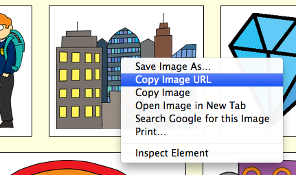

## Pronalaženje sopstvene slike

Hajde da na internetu pronađemo sliku koju ćemo dodati u tvoju priču.

+ Idi na [ovu stranicu](http://jumpto.cc/html-images){:target="_blank"} i pronađi sliku koju želiš da dodaš u svoju priču.

+ Klikni desnim tasterom miša na sliku, a zatim klikni na **Copy Image URL** (ili na **Copy Image Address**, zavisno od računara koji koristiš). URL je adresa slike.

+ Vrati se na svoju stranicu `index.htm`.

+ Zalijepi URL između navodnika unutar svoje oznake ``. Trebalo bi da se pojavi tvoja slika!

