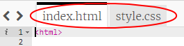

\--- challenge \---

## Challenge: ചില മാറ്റങ്ങൾ വരുത്തുക

നിങ്ങളുടെ വെബ്‌പേജ് ഇഷ്‌ടാനുസൃതമാക്കുന്നതിന് HTML, CSS കോഡ് എഡിറ്റുചെയ്യുക.

HTML ഉള്ളടക്കം `index.html` എന്ന ഫയലിലും CSS സ്റ്റൈൽ `style.css` എന്ന ഫയലിലും കണാം.

വെബ്‌പേജിൽ‌ ഉപയോഗിക്കുന്ന നിറങ്ങളിൽ മാറ്റം വരുത്താനും നിങ്ങൾക്ക് കഴിയും, കൂടാതെ ഇനിപ്പറയുന്ന ഫോണ്ടുകൾ‌ ഉപയോഗിക്കാം:

+ Arial
+ Comic Sans MS
+ Impact
+ Tahoma

കൂടുതൽ CSS colour names [ഇവിടെ കണ്ടെത്തുക](http://jumpto.cc/colours).

\--- /challenge \---