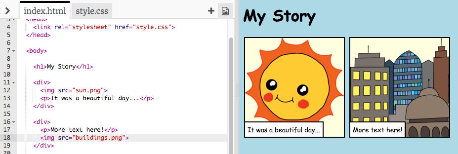

## നിങ്ങളുടെ കഥ പറച്ചിൽ

നിങ്ങളുടെ കഥയിൽ ഒരു രണ്ടാം ഭാഗം ചേർക്കാം.

+ കോഡിന്റെ പതിനഞ്ചാം വരിയിലേക്ക് പോയി `<div>`, `</div>` എന്നിവയുടെ മറ്റൊരു സെറ്റ് ആരംഭ, അവസാന ടാഗുകൾ ചേർക്കുക. ഇത് നിങ്ങളുടെ സ്റ്റോറിയുടെ അടുത്ത ഭാഗത്തിനായി ഒരു പുതിയ ബോക്സ് സൃഷ്ടിക്കും.


+ നിങ്ങളുടെ പുതിയ `<div>` ടാഗിനുള്ളിൽ വാചകങ്ങളുടെ ഒരു ഖണ്ഡിക ചേർക്കുക:

```html
<p>More text here!</p>
```


+ നിങ്ങളുടെ `<div>` ടാഗിനുള്ളിൽ ഈ കോഡ് ചേർത്തുകൊണ്ട് ഒരു ചിത്രം പുതിയ ബോക്സിൽ പ്രദർശിപ്പിക്കാൻ കഴിയും:

```html

```


`` ടാഗുകൾ‌ മറ്റ് ടാഗുകളിൽ‌ നിന്നും അൽ‌പം വ്യത്യസ്തമാണെന്ന് ശ്രദ്ധിക്കുക: അവയ്‌ക്ക് അവസാന ടാഗ് ഇല്ല.

+ ഒരു ചിത്രം പ്രദർശിപ്പിക്കുന്നതിനായി, നിങ്ങൾ സംഭാഷണ ചിഹ്നത്തിനുള്ളിലെ ചിത്രത്തിന്റെ **സോഴ്സ്** (` src `) ചേർക്കേണ്ടതുണ്ട്.

നിങ്ങളുടെ സ്റ്റോറിക്ക് ലഭ്യമായ ഇമേജുകൾ കാണുന്നതിന് ഇമേജ് ഐക്കണിൽ ക്ലിക്കുചെയ്യുക.


+ ഏത് ചിത്രമാണ് ചേർക്കേണ്ടതെന്നു തീരുമാനിക്കുകയും അതിന്റെ പേര് ഓര്മിക്കുകയും ചെയ്യുക, ഉദാഹരണത്തിന് `buildings.png`.

+ നിങ്ങളുടെ കോഡിലേക്ക് മടങ്ങുന്നതിന് `index.html` ൽ ക്ലിക്കുചെയ്യുക.


+ നിങ്ങളുടെ `` ടാഗിലെ സംഭാഷണ അടയാളങ്ങൾക്കിടയിൽ (" ") ചിത്രത്തിന്റെ പേര് ചേർക്കുക.

```html

```

