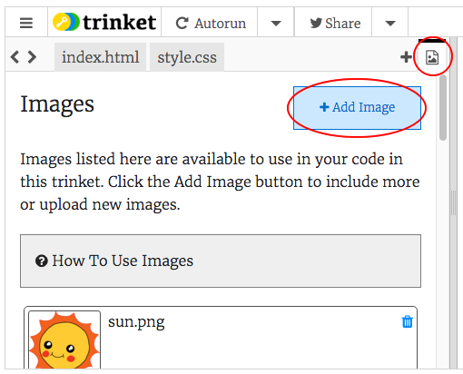

## ചിത്രങ്ങൾ അപ്‌ലോഡുചെയ്യുന്നു

നിങ്ങൾക്ക് ഒരു ** ട്രിങ്കറ്റ് അക്കൗണ്ട് ** ഉണ്ടെങ്കിൽ, നിങ്ങളുടെ വെബ്‌പേജിലേക്ക് നിങ്ങളുടെ സ്വന്തം ഇമേജുകൾ അപ്‌ലോഡ് ചെയ്യാനും കഴിയും.

+ നിങ്ങളുടെ ട്രിങ്കറ്റിന്റെ മുകളിലുള്ള ഇമേജ് ഐക്കണിൽ ക്ലിക്കുചെയ്യുക, തുടർന്ന് ** Add Image ** ക്ലിക്കുചെയ്യുക.



+ ** അപ്‌ലോഡ് ബട്ടൺ ** ക്ലിക്കുചെയ്യുക, തുടർന്ന് നിങ്ങളുടെ കമ്പ്യൂട്ടറിൽ ഉപയോഗിക്കാൻ ആഗ്രഹിക്കുന്ന ഇമേജ് കണ്ടെത്തി ബോക്സിലേക്ക് വലിച്ചിടുക. അല്ലെങ്കിൽ, അത് തിരഞ്ഞെടുക്കാൻ ബട്ടൺ ഉപയോഗിക്കുക.


+ നിങ്ങളുടെ `` ടാഗിലെ സംഭാഷണ അടയാളങ്ങൾക്കിടയിൽ (" ") ചിത്രത്തിന്റെ പേര് ഇതുപോലെ ചേർക്കുക:

```html

```