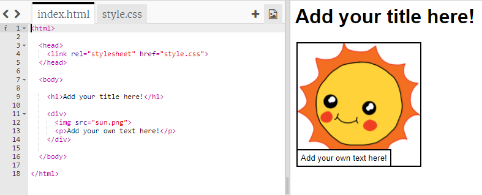
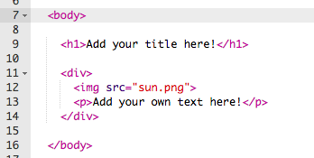

## तुमची कथा संपादित करणे

चला HTML सामग्री आणि कथेच्या webpage ची CSS शैली संपादित करून सुरुवात करूया.

+ [ हे trinket](http://jumpto.cc/web-story){:target="_blank"} उघडा.

प्रकल्प ह्यासारखा दिसायला हवा:

Webpage सामग्री `<body>` जो `index.html` HTML दस्तऐवजच्या विभाग आहे त्यात जाते.

+ `<body>` आणि ` </body>` टॅग्जच्या आत, ओळी 7 च्या पासून webpage च्या आतली सामग्री शोधा.

+ Webpage चे वेगेळे भाग तयार करण्यासठी कोणते टॅग वापरले जातात ते आपण कार्य करूण पहा.

--- collapse ---
---
title: उत्तर
---

+ `<h1>` हे **शीर्षक आहे**. वेगवेगळ्या आकारांची शीर्षके तयार करण्यासाठी आपण 1 ते 6 नंबर वापरू शकता.
+ `
`हे **छोटं विभागासाठी आहे**, आणि सामग्री एकत्रित करण्याचा एक मार्ग आहे. या webpage मध्ये आपण आपल्या कथेच्या प्रत्येक भागासाठी सर्व सामग्री एकत्रित करण्यासाठी याचा वापर कराल.
+ `` एक **प्रतिमा** आहे.
+ `
`एक **परिच्छेद आहे** मजकुराचा.

--- /collapse ---