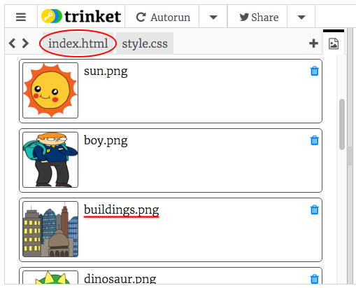

## तुमची कथा सांगणे

चला आपल्या कथेत दुसरा भाग जोडू.

+ कोडच्या 15 व्या ओळीवर जा आणि `<div>` आणि`</div>`सुरवातीचे आणि शेवटचे टॅग दुसर्‍या सेटमध्ये जोडा. हे आपल्या कथेच्या पुढील भागासाठी एक नवीन बॉक्स तयार करेल.


+ आपल्या नवीन `<div>` टॅगमध्ये मजकूराचा एक परिच्छेद जोडा:

```html
<p> येथे अधिक मजकूर! </p>
```


+ आपल्या `<div>` टॅगमध्ये हा कोड जोडून आपण आपल्या नवीन बॉक्समध्ये प्रतिमा प्रदर्शित करू शकता:

```html

```


लक्षात घ्या की अन्य टॅगपेक्षा `` टॅग थोडासा वेगळा आहे: त्याच्याकडे शेवटचा टॅग नाही.

+ दर्शविण्यासाठी प्रतिमा मिळवायची असेल, तर आपल्याला ** प्रतिमेचे स्त्रोत जोडणे आवश्यकआहे ** (` src ` ) जे भाषण चिन्यांमध्ये आहे.

आपल्या कथेसाठी उपलब्ध प्रतिमा पाहण्यासाठी प्रतिमा चिन्हावर क्लिक करा.


+ आपल्याला कोणती प्रतिमा जोडायची ते निश्चित करा आणि त्याचे नाव लक्षात ठेवा, उदाहरणार्थ `buildings.png`.

+ आपल्या कोडवर परत जाण्यासाठी `index.html` वर क्लिक करा.



+ आपल्या `` टॅगमधील भाषण चिन्हांदरम्यान आपल्या नवीन प्रतिमेचे नाव याप्रमाणे जोडा.

```html

```

