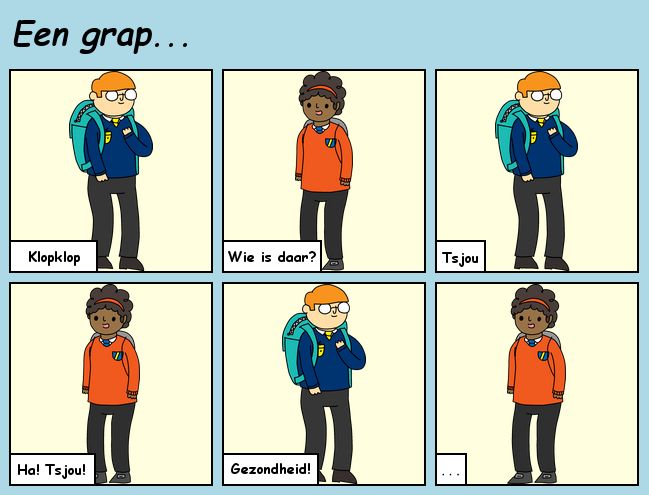

## Inleiding

In dit project leer je hoe je je eigen webpagina kunt maken om een ​​verhaal, grap of gedicht te vertellen.

### Wat ga je maken

Blader naar beneden in de trinket om de clou te zien!

  <iframe src="https://trinket.io/embed/html/c8afdef912?outputOnly=true&start=result" width="600" height="450" frameborder="0" marginwidth="0" marginheight="0" allowfullscreen>
  </iframe>
  

### Wat ga je leren

Dit project behandelt elementen uit de volgende onderdelen van de [Raspberry Pi Digital Making Curriculum](http://rpf.io/curriculum){:target="_blank"}:

+ [Ontwerp standaard 2D- en 3D-items](https://www.raspberrypi.org/curriculum/design/creator){:target="_blank"}.

### Aanvullende informatie voor clubleiders

Als je dit project wilt afdrukken, gebruik dan de [printervriendelijke versie](https://projects.raspberrypi.org/en/projects/tell-a-story/print){:target="_blank"}.

Gebruik de link in de voettekst om toegang te krijgen tot de GitHub-repository voor dit project, dat alle bronnen (inclusief een voorbeeld van een voltooid project) bevat in de map 'en/resources'.