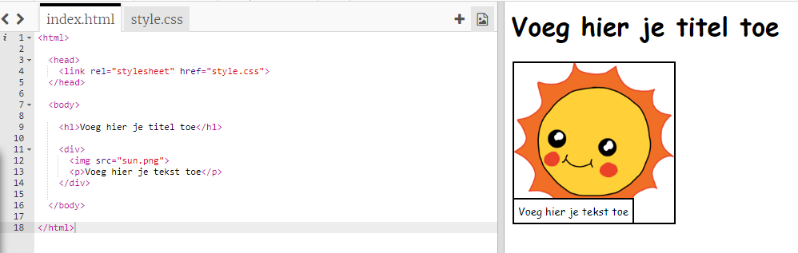
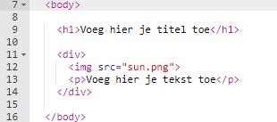
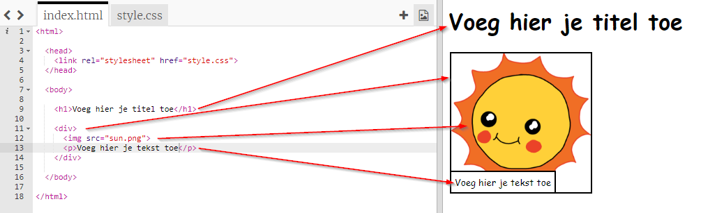

## Je verhaal bewerken

Laten we beginnen met het bewerken van de HTML-inhoud en CSS-stijl van de webpagina van het verhaal.

+ Open [deze trinket](http://jumpto.cc/web-story){:target="_blank"}.

Het project zou er als volgt uit moeten zien:

De inhoud van webpagina's komt in het gedeelte `<body>` van het `index.html` HTML-document.

+ Zoek de inhoud van de webpagina vanaf regel 7 binnen de `<body>` en `</body>` tags.

+ Kijk of je kunt uitzoeken welke tags worden gebruikt om de verschillende delen van de webpagina te maken.

## \--- collapse \---

## title: Antwoord

+ `<h1>` is een **kop** (Engels: heading). Je kunt de nummers 1 tot 6 gebruiken om koppen van verschillende formaten te maken.
+ `
` is een afkorting van **division** en is een manier om dingen samen te groeperen. In deze webpagina gebruik je het om alle dingen voor je verhaal te groeperen.
+ `` is een **afbeelding**.
+ `
` is een **alinea** van tekst.

\--- /collapse \---