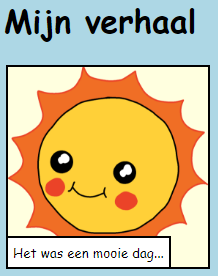

--- challenge ---

## Uitdaging: breng enkele wijzigingen aan

Bewerk de HTML- en CSS-code om je webpagina aan te passen.

De HTML-inhoud is te vinden in het `index.html` bestand en de CSS-stijl in het `style.css` bestand.

Je kunt ook de kleuren die op de webpagina worden gebruikt wijzigen en je kunt verschillende lettertypen gebruiken, zoals:

+ Arial
+ Comic Sans MS
+ Impact
+ Tahoma

Vind [hier](http://jumpto.cc/colours){:target="_blank"} meer CSS-kleurnamen.

--- /challenge ---