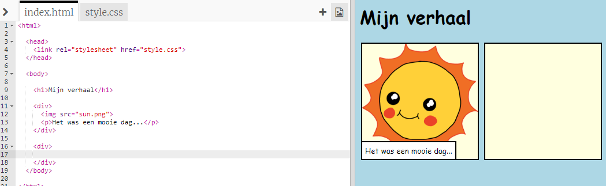
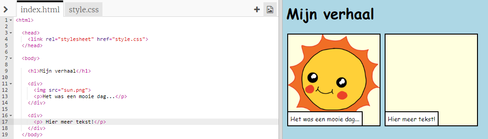
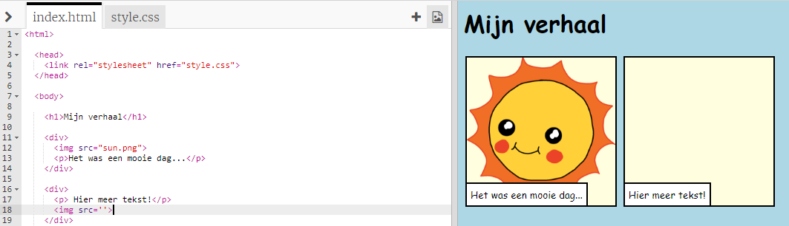
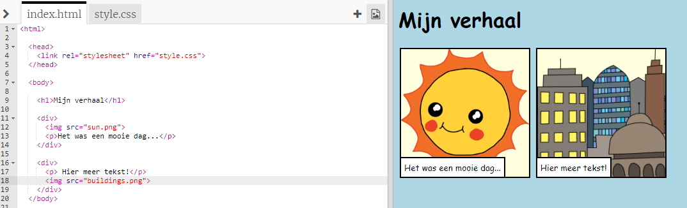

## Je verhaal vertellen

Laten we een tweede deel aan je verhaal toevoegen.

+ Ga naar regel 15 van de code en voeg nieuwe `<div>` en `</div>` begin- en eindtags toe. Hiermee wordt een nieuw vak gemaakt voor het volgende deel van je verhaal.



+ Voeg een alinea tekst toe aan de nieuwe `<div>` tag:

```html
<p>Hier meer tekst!</p>
```



+ Je kunt een afbeelding in je nieuwe vak weergeven door deze code toe te voegen aan je `<div>` tag:

```html

```



Merk op dat `` -tags een beetje verschillen van andere tags: ze hebben geen eindtag.

+ Als je wilt dat een afbeelding wordt weergegeven, moet je de **de naam van de afbeelding** (`src`) tussen de aanhalingstekens invoegen.

Klik op het afbeeldingspictogram om de beschikbare afbeeldingen voor je verhaal te bekijken.


+ Kies de afbeelding die je wilt toevoegen en onthoud de naam ervan, bijvoorbeeld `buildings.png`.

+ Klik op `index.html` om terug te gaan naar je code.


+ Voeg de naam van de afbeelding toe tussen de aanhalingstekens van je `` tag.

```html

```


