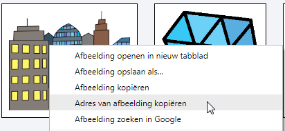
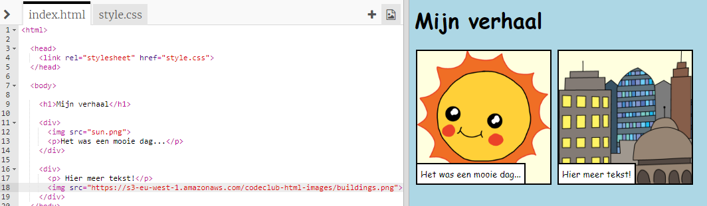

## Je eigen afbeeldingen zoeken

Laten we een afbeelding op internet zoeken die je aan je verhaal kunt toevoegen.

+ Ga naar [deze pagina](http://jumpto.cc/html-images){: target = "_ blank"} en vind een afbeelding die je in je verhaal wilt opnemen.

+ Klik met de rechtermuisknop op de afbeelding en klik op **Afbeeldings-URL** (of **Adres van afbeelding kopiëren** kopiëren, afhankelijk van de computer die je gebruikt). De URL is het adres van de afbeelding.

+ Ga terug naar je `index.html` pagina.

+ Plak de URL tussen de aanhalingstekens in je `` tag. Je zou je afbeelding moeten zien verschijnen!

