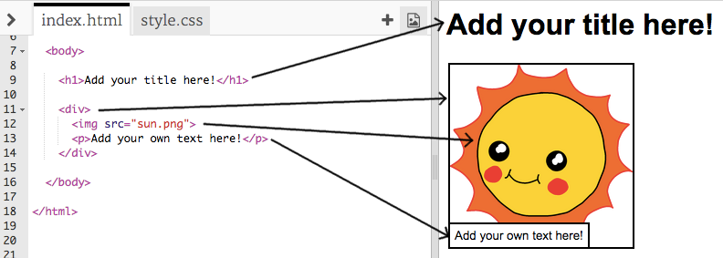

## Redigerer historien din

La oss starte med å redigere HTML-innholdet og CSS-stilen på historiens nettside.

+ Åpne [denne trinket](http://jumpto.cc/web-story){: target = "_ blank"}.

Prosjektet skal se slik ut:

Nettstedets innhold går i `<body>` delen av `indeksen.html` HTML-dokument.

+ Finn innholdet på nettsiden fra linje 7 og fremover, inne i `<body>` og `</body>` tagger.

+ Se om du kan finne ut hvilke merker som brukes til å opprette de ulike delene av nettsiden.

## \--- kollaps \---

## tittel: Svar

+ `<h1>` er en **overskrift**. Du kan bruke tallene 1 til 6 for å lage overskrifter av forskjellige størrelser.
+ `
` er kort for **divisjon**, og er en måte å gruppere ting sammen. På denne nettsiden bruker du den til å gruppere alle ting for hver del av historien din.
+ `` er et **bilde**.
+ `
` er en **paragraf** i tekst.

\--- / kollaps \---