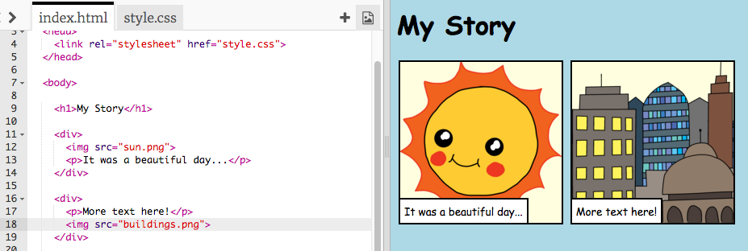

## Forteller historien din

La oss legge til en annen del av historien din.

+ Gå til linje 15 i koden, og legg til i et annet sett med `<div>` og `</div>` start- og sluttkoder. Dette vil skape en ny boks for neste del av historien din.


+ Legg til et avsnitt med tekst inni din nye `<div>` tag:

```html
<p>Mer tekst her!</p>
```


+ Du kan vise et bilde i den nye boksen ved å legge til denne koden i `<div>` taggen din:

```html

```


Legg merke til at `` koder er litt annerledes enn andre koder: de har ikke en sluttkode.

+ For å få et bilde som skal vises, må du legge til **kilde** (`src`) av bildet inne i talemerkene.

Klikk på bildeikonet for å se bildene som er tilgjengelige for historien din.


+ Bestem hvilket bilde du vil legge til og husk navnet sitt, for eksempel `buildings.png`.

+ Klikk på `index.html` å komme tilbake til koden din.


+ Legg til navnet på bildet mellom talemerkene i `` taggen din.

```html

```

