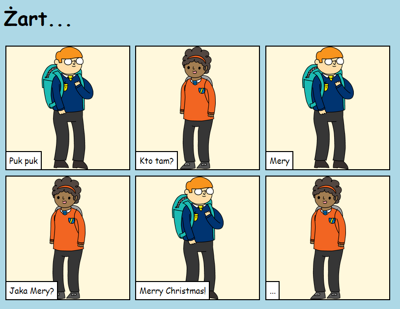

## Wprowadzenie

W tym projekcie nauczysz się, jak stworzyć własną stronę internetową, aby opowiedzieć historię, dowcip lub wiersz.

### Co będziesz robił

Przewiń w dół okna Trinket, aby poznać zakończenie!

  <iframe src="https://trinket.io/embed/html/d9a8d0bd6b?outputOnly=true&start=result" width="600" height="450" frameborder="0" marginwidth="0" marginheight="0" allowfullscreen>
  </iframe>
  

### Czego się nauczysz

Ten projekt pokrywa elementy z następujących wątków z [Cyfrowego Programu Nauczania Raspberry Pi](https://rpf.io/curriculum){:target="_blank"}:

+ [Projektowanie podstawowych zasobów 2D i 3D](https://www.raspberrypi.org/curriculum/design/creator){:target="_blank"}.

### Dodatkowe informacje dla nauczycieli

Jeśli chcesz wydrukować ten projekt, użyj [wersji do druku](https://projects.raspberrypi.org/pl-PL/projects/tell-a-story/print){:target="_blank"}.

Skorzystaj z odnośnika w stopce, aby uzyskać dostęp do repozytorium kodu tego projektu w serwisie GitHub. Repozytorium to zawiera wszystkie zasoby (w tym przykład gotowego projektu) w folderze 'en/resources'.