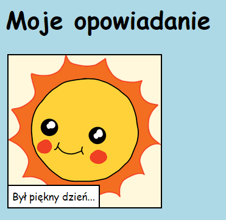

\--- wyzwanie \---

## Challenge: make some changes

Edit the HTML and CSS code to customise your webpage.

The HTML content can be found in the `index.html` file, and the CSS style in the `style.css` file.

You can also alter the colours used in the webpage, and you can use different fonts such as:

+ Arial
+ Comic Sans MS
+ Impact
+ Tahoma

Find more CSS colour names [here](http://jumpto.cc/colours){:target="_blank"}.

\--- /challenge \---