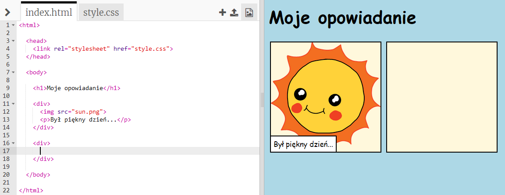
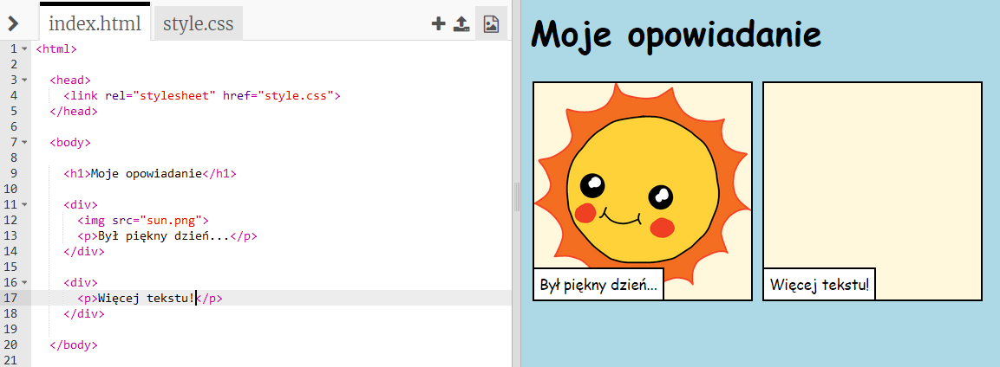
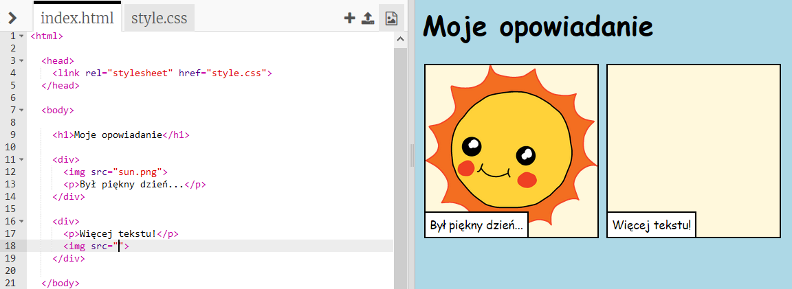
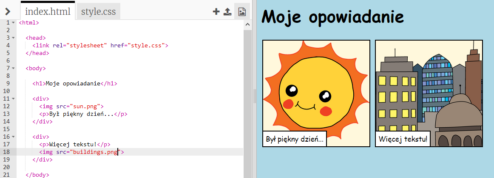

## Opowiedz swoją historię

Dodajmy drugą część do twojej historii.

+ Przejdź do linii 15 kodu i dodaj kolejny zestaw tagów otwierających `<div>` oraz zamykających `</div>`.



+ Dodaj akapit tekstu wewnątrz nowego tagu `<div>`:

```html
<p>Więcej tekstu!</p>
```



+ Możesz wyświetlić obraz w nowym polu, dodając ten kod do tagu `<div>`:

```html

```



Zauważ, że tagi `` są nieco inne od pozostałych znaczników: nie mają tagu końcowego.

+ Aby wyświetlić obraz, musisz dodać **źródło** (`src`) obrazu wewnątrz cudzysłowowa.

Kliknij ikonę obrazu, aby zobaczyć grafiki dostępne dla Twojej historii.


+ Zdecyduj, który obrazek chcesz dodać i zapamiętaj jego nazwę, na przykład ` buildings.png`.

+ Kliknij na `index.html`, aby wrócić do swojego kodu.


+ Dodaj nazwę obrazka pomiędzy znaki cudzysłowu w znaczniku ``.

```html

```

