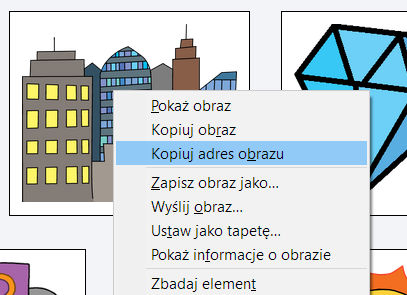
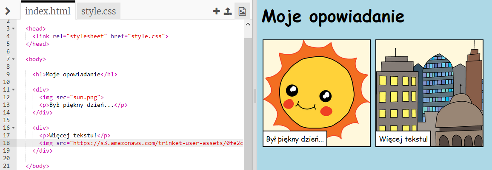

## Poszukiwanie własnych obrazków

Znajdźmy obraz w sieci, aby dodać go do Twojej historii.

+ Przejdź do [tej strony](http://jumpto.cc/html-images){:target="_blank"} i znajdź obraz, który chciałbyś dołączyć do swojej historii.

+ Kliknij obraz prawym przyciskiem myszy i kliknij **Kopiuj adres URL obrazu** (lub ** Kopiuj adres obrazu **, w zależności od używanego komputera). Adres URL jest adresem obrazu.

+ Wróć do swojej strony `index.html`.

+ Wklej adres URL pomiędzy znaki cudzysłowu w znaczniku ``. Powinieneś teraz zobaczyć swój obraz!

