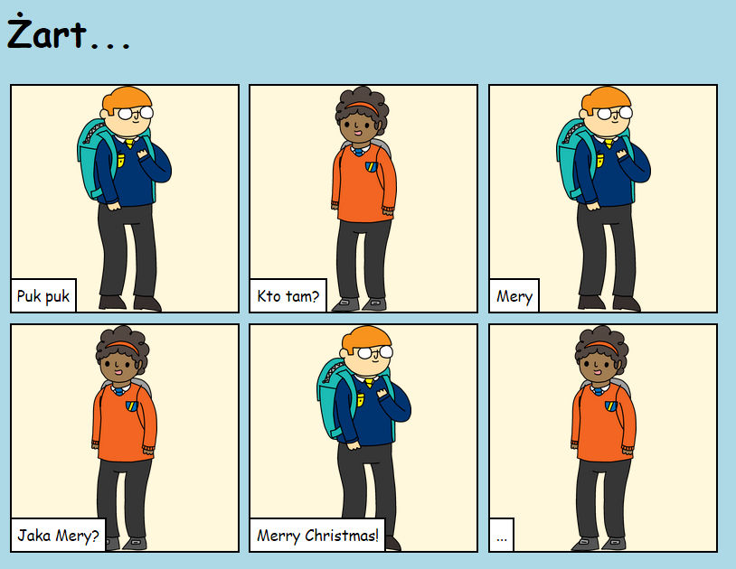

--- challenge ---

## Wyzwanie: nie zatrzymuj się!

Wykorzystaj to, czego nauczyłeś się w tym projekcie, aby opowiedzieć historię do końca! Oto przykład:

--- /challenge ---

**Tłumaczenie wykonane przez wolontariuszy**

Projekt ten przetłumaczył **Tomasz Przybyłek** a zweryfikował **Jon Kryzanski**.

Dzięki naszym wspaniałym wolontariuszom, ludzie na całym świecie mogą nauczyć się kodowania. Tłumacząc nasze projekty możesz pomóc nam dotrzeć do większej liczby ludzi. Więcej informacji na stronie [rpf.io/translate](https://rpf.io/translate).