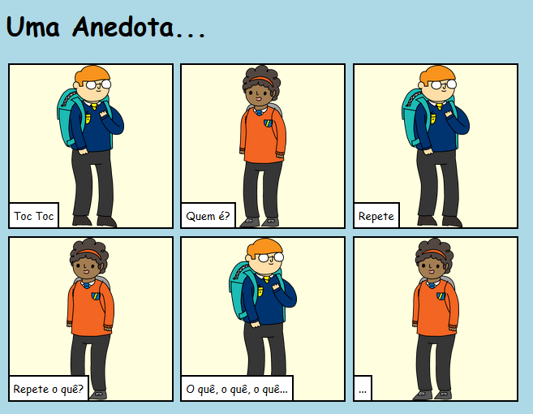

## Introdução

Neste projeto, você aprenderá como criar sua própria página da web para contar uma história, anedota, piada, ou poema.

### O que você vai fazer

Role para baixo no Trinket para ver o final!

  <iframe src="https://trinket.io/embed/html/c8afdef912?outputOnly=true&start=result" width="600" height="450" frameborder="0" marginwidth="0" marginheight="0" allowfullscreen>
  </iframe>
  

### O que você vai aprender

Este projeto abrange elementos das seguintes vertentes do [Currículo de Fabricação Digital Raspberry Pi](http://rpf.io/curriculum){:target="_ blank"}:

+ [Faça ilustrações 2D e 3D básicas](https://www.raspberrypi.org/curriculum/design/creator) {:target="_blank"}.

### Informações adicionais para educadores

Se você precisar imprimir este projeto, por favor, use a [versão para impressão](https://projects.raspberrypi.org/en/projects/tell-a-story/print){:target="_blank"} .

Use o link no rodapé para acessar o repositório do GitHub para este projeto, que contém todos os recursos (incluindo um exemplo de projeto concluído) na pasta 'en / resources'.