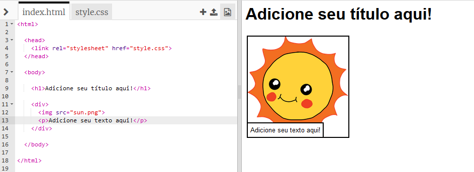
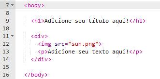

## Editando sua história

Vamos começar editando o conteúdo HTML e CSS da página web da história.

+ Abra [este trinket](http://jumpto.cc/web-story) {:target="_blank"}.

O arquivo ficará assim:

O conteúdo da página fica na seção `<body>` do `index.html` documento HTML.

+ Encontre o conteúdo da página web a partir da linha 7, dentro das tags `<body>` e `</body>`.

+ Veja se pode descobrir quais tags são usadas para criar as diferentes partes da página web.

## \--- collapse \---

## title: Resposta

+ `<h1>` é um **cabeçalho (heading)**. Você pode usar os números de 1 a 6 para criar cabeçalhos de diferentes tamanhos.
+ `
` é abreviação de **divisão**, e é uma maneira de agrupar coisas. Nesta página web, você a usará para agrupar todas as informações de cada parte da sua história.
+ `` é uma **imagem (image)**.
+ `
` é um **parágrafo** de texto.

\--- /collapse \---