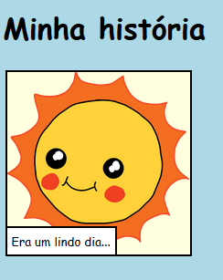
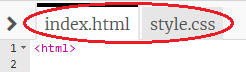

\--- challenge \---

## Desafio: faça algumas alterações

Edite os códigos HTML e CSS para personalizar sua página web.

O conteúdo HTML pode ser encontrado no arquivo `index.html`, e o CSS no arquivo `style.css`.

Você também pode alterar as cores usadas na página web e pode usar diferentes fontes, como:

+ Arial
+ Comic Sans MS
+ Impact
+ Tahoma

Você pode encontrar mais nomes de cores CSS [aqui](http://jumpto.cc/colours){:target="_blank"}.

\--- /challenge \---