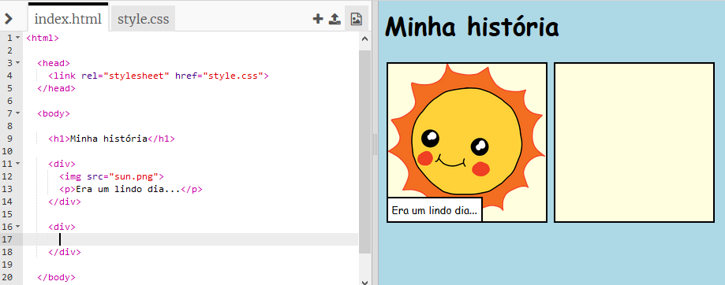
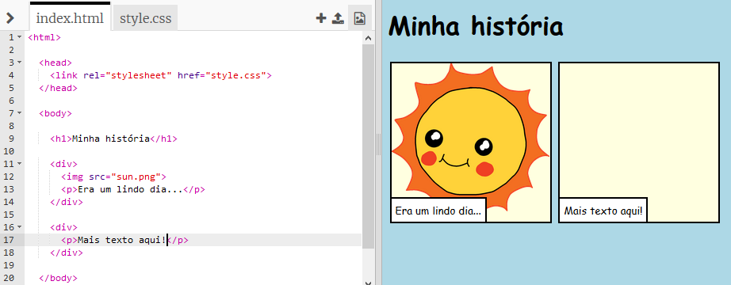
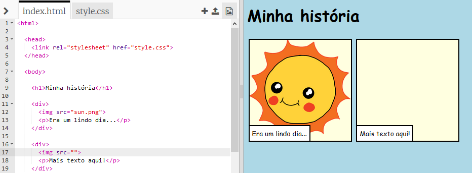
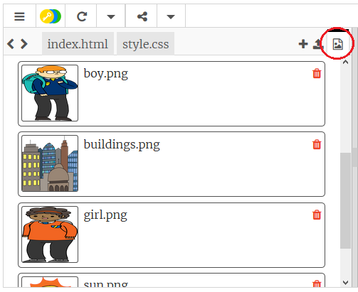
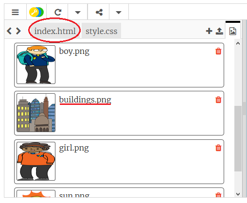
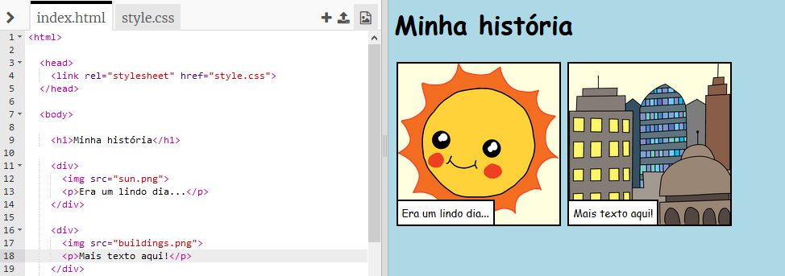

## Contando sua história

Vamos adicionar uma segunda parte à sua história.

+ Vá para a linha 15 do código e adicione outro conjunto de `<div>` e `</div>`, ou seja, tags de início e fim. Isso vai criar uma nova caixa para a próxima parte de sua história.



+ Adicione um parágrafo de texto dentro da sua nova tag `<div>`:

```html
<p>Mais texto aqui!</p>
```



+ Você pode exibir uma imagem em sua nova caixa adicionando este código dentro de sua tag `<div>`:

```html

```



Observe que as tags `` são um pouco diferentes das outras tags: elas não tem uma tag final.

+ Para fazer uma imagem aparecer, você precisa colocar a **fonte** (`src`) da imagem dentro das aspas.

Clique no ícone de imagem para ver as imagens disponíveis para sua história.



+ Decida qual imagem você deseja adicionar e lembre seu nome, por exemplo `buildings.png`.

+ Clique em `index.html` para voltar ao seu código.



+ Coloque o nome da imagem entre as aspas na tag ``.

```html

```

