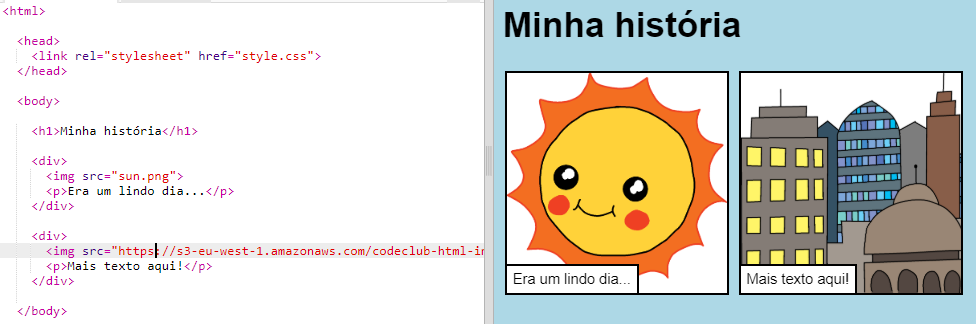

## Encontrando suas próprias imagens

Vamos encontrar uma imagem na web para adicionar à sua história.

+ Vá para [esta página](http://jumpto.cc/html-images){:target="_blank"} e encontre uma imagem que você queira incluir em sua história.

+ Clique com o botão direito na imagem e clique em **Copiar URL da imagem** (ou **Copiar endereço da imagem**, dependendo do computador que você está usando). O URL é o endereço da imagem.

+ Volte para sua página `index.html`.

+ Cole o URL entre as aspas em sua tag ``. Você deve ver sua imagem aparecer!

