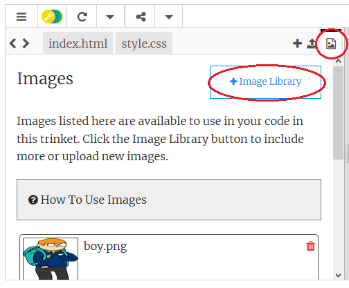

## Carregando imagens

**Se você tem uma conta no Trinket**, você também pode carregar suas próprias imagens em sua página web.

+ Clique no ícone da imagem na parte superior do seu trinket, e depois clique **Adicionar Imagem**.



+ Clique no botão **Carregar** e, em seguida, encontre em seu computador a imagem que você deseja usar e arraste-a para a caixa. Um outra alternativa é usar o botão para selecioná-la.


+ Agora, adicione o nome de sua nova imagem entre as aspas em sua tag ``, desta forma:

```html

```