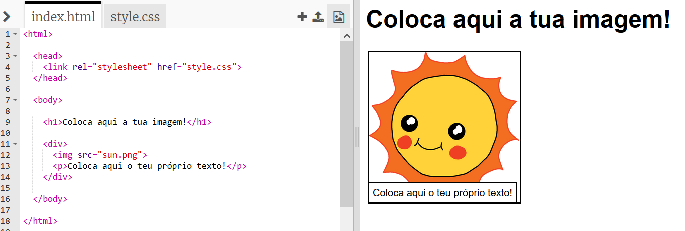
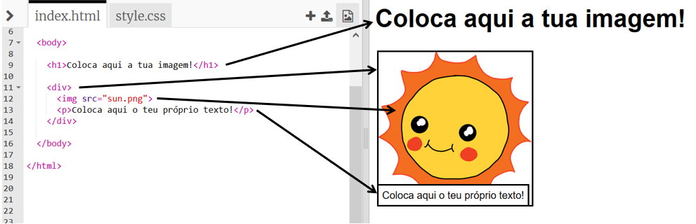

## Editing your story

Let's start by editing the HTML content and CSS style of the story's webpage.

+ Open [this trinket](http://jumpto.cc/web-story){:target="_blank"}.

The project should look like this:

O conteúdo da página fica na secção `<body>`</0> do ficheiro HTML `index.html`.
 

+ Encontras o conteúdo da página de Internet a partir da linha 7 em diante, dentro das tags `<body>`</0> e `<body/>`.</li> </ul> 
    
    
    
    + See if you can work out which tags are used to create the different parts of the webpage.
    
    ## \--- collapse \---
    
    ## title: Answer
    
    
    
    + `<h1>` is a **heading**. You can use the numbers 1 to 6 to create headings of different sizes.
    + `
` is short for **division**, and is a way of grouping stuff together. In this webpage, you'll use it to group together all the stuff for each part of your story.
    + `` is an **image**.
    + `
` is a **paragraph** of text.
    
    \--- /collapse \---