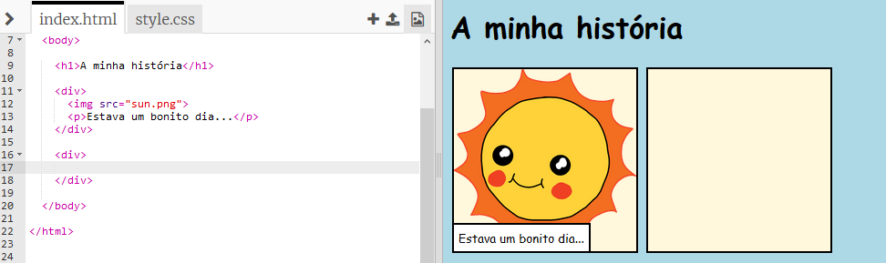
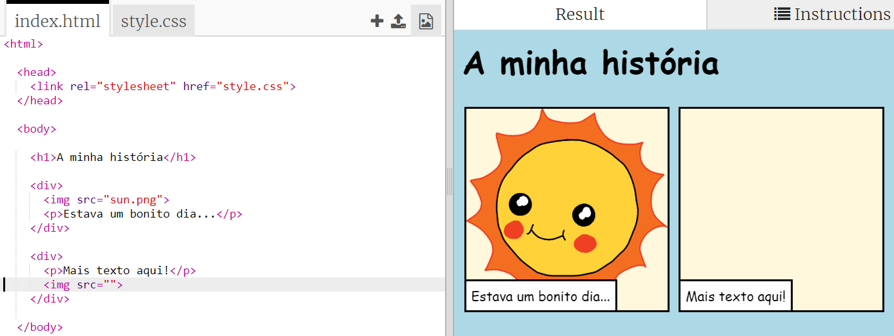
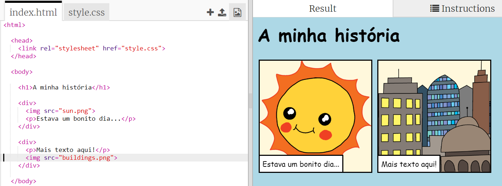

## Contar a tua história

Vamos acrescentar uma segunda parte à tua história.

+ Vai até à linha 15 do código e adiciona outro conjunto de etiquetas de início e fim `<div>` e `</div>`. Isto vai criar uma nova caixa para a próxima parte da tua história.



+ Adiciona um parágrafo de texto dentro da tua nova etiqueta HTML `<div>`:

```html
<p>Mais texto aqui!</p>
```


+ Podes apresentar uma imagem na tua nova caixa adicionando este código à tua etiqueta HTML `<div>`:

```html

```



Repara que as etiquetas HTML `` são um pouco diferentes das outras, pois não têm uma etiqueta de fim.

+ Para que uma imagem seja apresentada, vais necessitar adicionar a **origem** (`src`) da imagem dentro das aspas.

Clica no ícone da imagem para ver as que estão disponíveis para a tua história.


+ Escolhe a imagem que desejas adicionar e lembra-te do nome, por exemplo, `buildings.png`.

+ Clica em `index.html` para voltar ao teu código.


+ Adiciona o nome da imagem entre as aspas da tua etiqueta HTML ``.

```html

```

