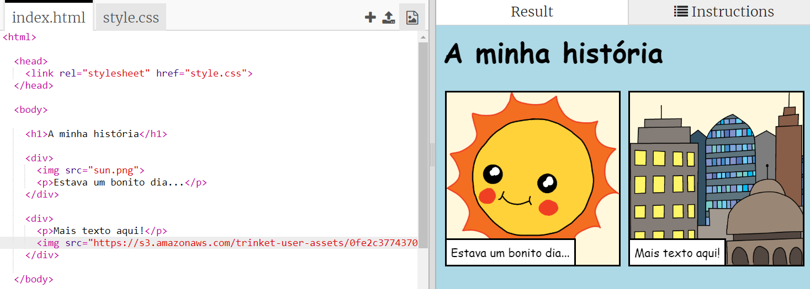

## Encontrar as tuas próprias imagens

Vamos encontrar uma imagem na Internet para adicionar à tua história.

+ Vai a [esta página](http://jumpto.cc/html-images){:target="_blank"} e encontra uma imagem que desejes incluir na tua história.

+ Clica com o botão direito do rato na imagem e clica em **Copiar URL da Imagem** (ou **Copiar endereço de imagem**, conforme o computador que estás a utilizar). O URL é o endereço de Internet da imagem.

+ Volta para a tua página `index.html`.

+ Cola o URL entre as aspas na tua etiqueta HTML ``. Repara que a imagem que escolheste apareceu!

