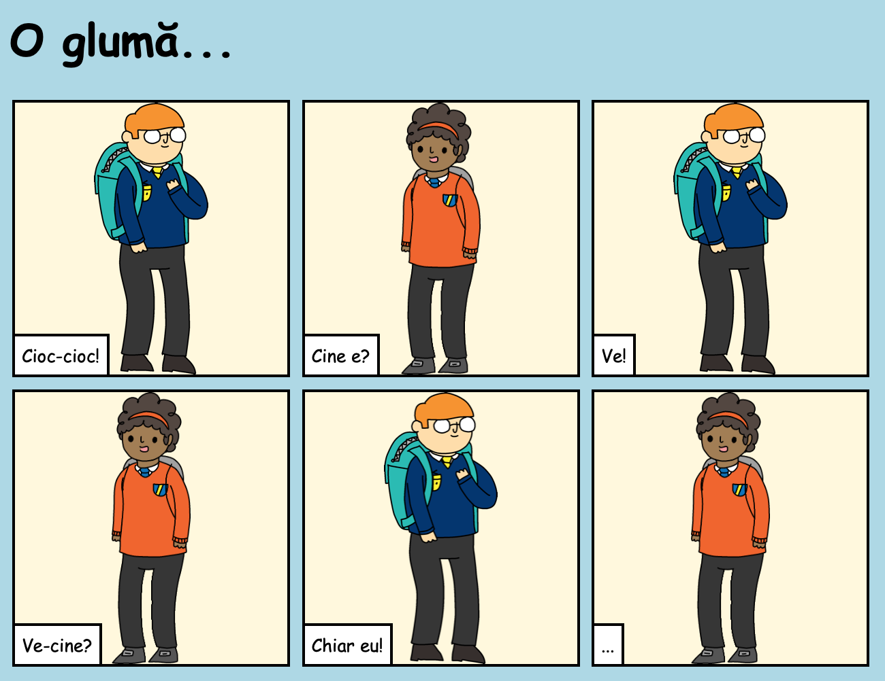

## Introducere

În acest proiect, vei învăța cum să îți creezi propria pagină web pentru a spune o poveste, o glumă sau o poezie.

### Ce vei face

Derulează în jos pentru a citi tot bancul!

  <iframe src="https://trinket.io/embed/html/ba52760eae?outputOnly=true&start=result" width="600" height="450" frameborder="0" marginwidth="0" marginheight="0" allowfullscreen>
  </iframe>
  

### Ce vei învăța

Acest proiect acoperă elemente din următoarele componente ale [Raspberry Pi Digital Making Curriculum](https://rpf.io/curriculum){:target="_blank"}:

+ [Proiectarea elementelor de bază în 2D și 3D](https://www.raspberrypi.org/curriculum/design/creator){:target="_blank"}.

### Informații suplimentare pentru educatori

Dacă ai nevoie să tipărești acest proiect, folosește [versiunea imprimabilă](https://projects.raspberrypi.org/ro-RO/projects/tell-a-story/print){:target="_blank"} .

Folosește link-ul din subsolul paginii pentru a accesa referința GitHub pentru acest proiect, care conține toate resursele (inclusiv un exemplu de proiect finalizat) în folder-ul „ro-RO/resources”.