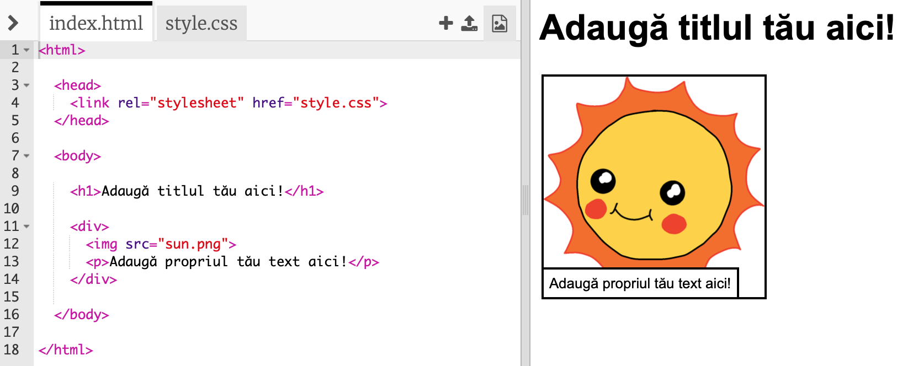
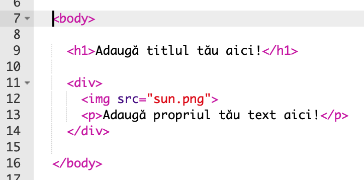
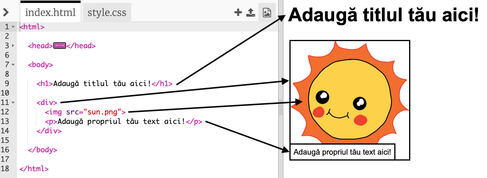

## Redactează-ți povestea

Să începem prin a edita conținutul HTML și stilului CSS al paginii web a poveștii.

+ Deschide [acest trinket](http://jumpto.cc/web-story){:target="_blank"}.

Proiectul ar trebui să arate astfel:

Conținutul paginii web intră în secțiunea `<body>` a documentului HTML `index.html`.

+ Găsește conținutul paginii web începând cu linia 7, în interiorul etichetelor `<body>` și ` </body>`.

+ Vezi dacă îți poți da seama ce etichete sunt folosite pentru a crea diferitele componente ale paginii web.

## \--- collapse \---

## title: Răspuns

+ `<h1>` este un **titlu**. Poți folosi numerele de la 1 la 6 pentru a crea titluri de diferite dimensiuni.
+ `
` este prescurtarea pentru **diviziune** și este un mod de a grupa lucrurile împreună. În această pagină web, vei folosi această etichetă pentru a grupa toate elementele din fiecare parte a poveștii tale.
+ `` este o **imagine**.
+ `
` este un ** alineat ** de text.

\--- /collapse \---