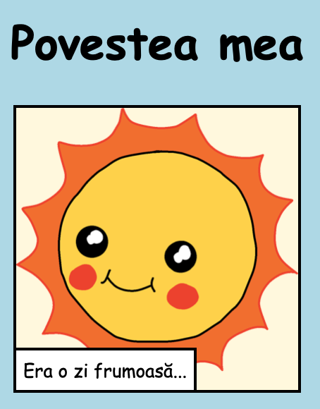
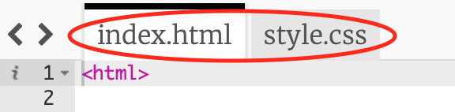

\--- challenge \---

## Provocare: fă niște modificări

Editează codul HTML și CSS pentru a-ți personaliza pagina web.

Conținutul HTML poate fi găsit în fișierul `index.html` și stilul CSS în fișierul `style.css`.

You can also alter the colours used in the webpage, and you can use different fonts such as:

+ Arial
+ Comic Sans MS
+ Impact
+ Tahoma

Poți găsi mai multe nume de culori pentru CSS [aici](http://jumpto.cc/colours){:target="_blank"}.

\--- /challenge \---