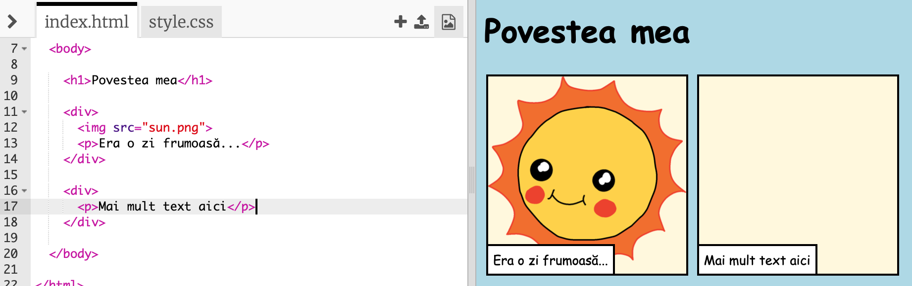

## Spune-ți povestea

Să adăugăm o a doua parte poveștii tale.

+ Mergi la linia 15 din cod și adaugă un nou set de etichete de început și sfârșit de tip `<div>` și `</div>`. Astfel, vei crea o casetă nouă pentru următoarea parte a poveștii tale.


+ Adaugă un alineat de text în interiorul noii tale etichete `<div>`:

```html
<p>Mai mult text aici!</p>
```



+ Poți afișa o imagine în noua casetă adăugând acest cod în eticheta `<div>`:

```html

```


Reține că etichetele `` sunt puțin diferite de alte etichete: ele nu au o etichetă de sfârșit.

+ Pentru a afișa o imagine, trebuie să adaugi **sursa** (`src`) imaginii în interiorul ghilimelelor.

Dă click pe pictograma de imagini pentru a vedea imaginile disponibile poveștii tale.


+ Decide ce imagine dorești să adaugi și reține-i denumirea, de exemplu `buildings.png`.

+ Fă click pe `index.html` pentru a reveni la codul tău.


+ Adaugă denumirea imaginii între ghilimelele din eticheta ``.

```html

```

