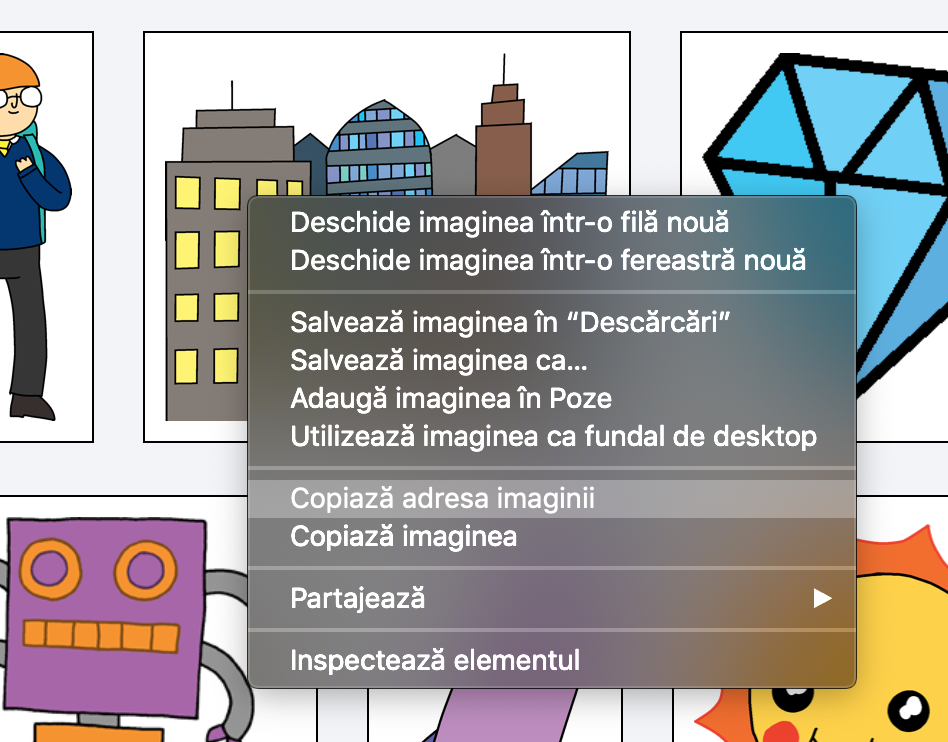

## Caută-ți propriile tale imagini

Hai să căutăm o imagine pe internet și să o adăugăm poveștii tale.

+ Accesează [această pagină](http://jumpto.cc/html-images){:target="_blank"} și caută o imagine pe care vrei să o incluzi în povestea ta.

+ Fă click-dreapta pe imagine, apoi click pe **Copiere URL imagine** (sau **Copiază adresa imaginii**, în funcție de computerul pe care îl folosești). URL-ul este adresa imaginii.

+ Revino la pagina `index.html`.

+ Paste the URL between the speech marks in your `` tag. You should see your image appear!

