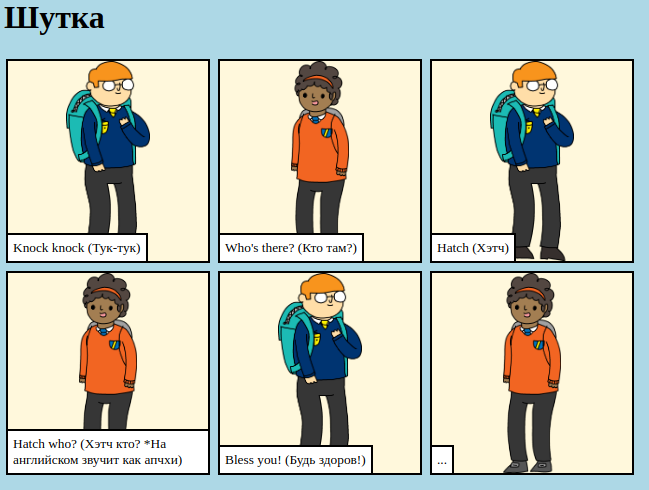

## Введение

В этом проекте ты узнаешь, как создать свою собственную веб-страницу, чтобы рассказать историю, шутку или стихотворение.

### Что ты будешь делать

Прокрути вниз в тринкет, чтобы увидеть суть шутки!

  <iframe src="https://trinket.io/embed/html/c8afdef912?outputOnly=true&start=result" width="600" height="450" frameborder="0" marginwidth="0" marginheight="0" allowfullscreen>
  </iframe>
  

### Чему ты научишься

Этот проект включает в себя элементы из [Raspberry Pi Digital Making Curriculum](http://rpf.io/curriculum){:target="_blank"}:

+ [Разработка базовых 2D и 3D ресурсов](https://www.raspberrypi.org/curriculum/design/creator){:target="_blank"}.

### Дополнительная информация для преподавателей

Если ты хочешь распечатать этот проект, то воспользуйся [версией для печати](https://projects.raspberrypi.org/en/projects/tell-a-story/print){:target="_blank"} .

Используйте ссылку в нижнем колонтитуле (в самом низу сайта) для доступа к репозиторию GitHub для этого проекта, который содержит все ресурсы (включая пример завершенного проекта) в папке «en / resources».