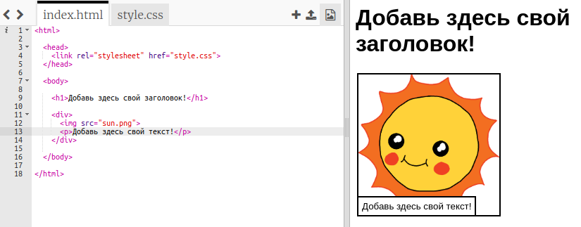
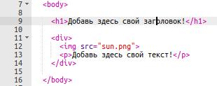
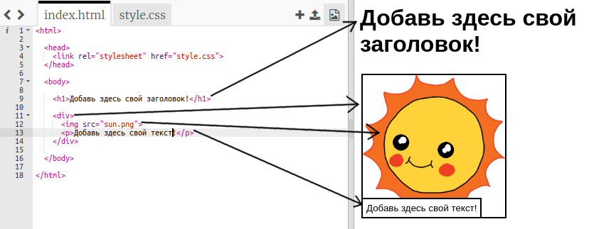

## Редактирование твоей истории

Начнем с редактирования содержимого HTML и стиля CSS веб-страницы истории.

+ Откройте [этот trinket](http://jumpto.cc/web-story){:target="_blank"}.

Проект должен выглядеть следующим образом:

Webpage content goes in the `<body>` section of the `index.html` HTML document.

+ Find the webpage content from line 7 onwards, inside `<body>` and `</body>` tags.

+ See if you can work out which tags are used to create the different parts of the webpage.

## \--- collapse \---

## title: Answer

+ `<h1>` is a **heading**. You can use the numbers 1 to 6 to create headings of different sizes.
+ `
` is short for **division**, and is a way of grouping stuff together. In this webpage, you'll use it to group together all the stuff for each part of your story.
+ `` is an **image**.
+ `
` is a **paragraph** of text.

\--- /collapse \---