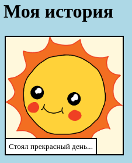

--- challenge ---

## Задача: внести некоторые изменения

Отредактируй код HTML и CSS, чтобы настроить свою веб-страницу.

Содержимое HTML можно найти в файле `index.html`, а стиль CSS в файле `style.css`.

Ты также можешь изменить цвета, используемые на веб-странице, и ты можешь использовать различные шрифты, такие как:

+ Arial
+ Comic Sans MS
+ Impact
+ Tahoma

Ты можешь найти больше названий цветов CSS [здесь](http://jumpto.cc/colours){:target="_blank"}.

--- /challenge ---