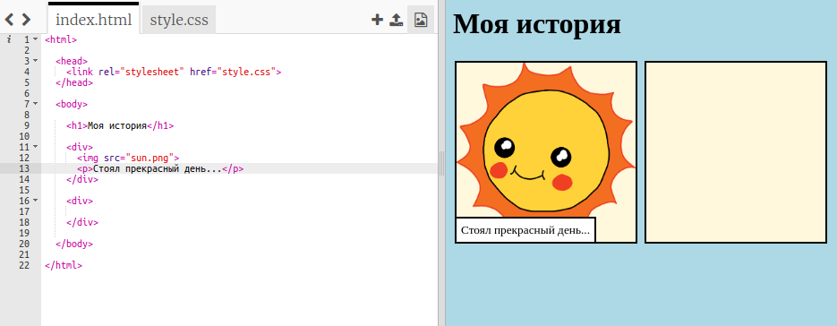
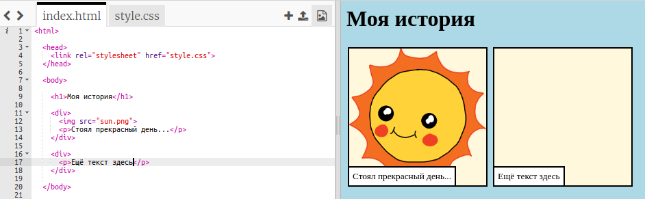
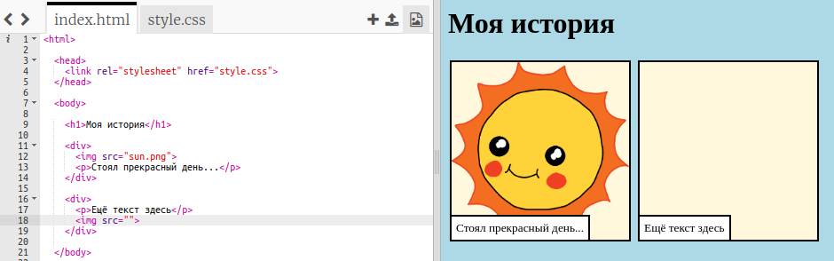
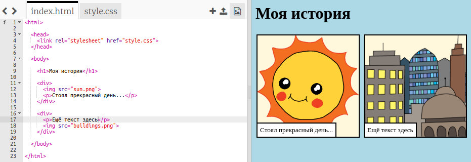

## Поделись своей историей

Давай добавим вторую часть к твоей истории.

+ Перейди к строке 15 кода и добавь еще один набор `<div>` и ` </div>` начальный и конечный теги. Это создаст новую коробку для следующей части вашей истории.



+ Добавь абзац текста внутри нового тега `<div>`:

```html
<p>Больше текста здесь!</p>
```



+ Ты можешь отобразить изображение в новом окне, добавив этот код внутри тега `<div>`:

```html

```



Обрати внимание, что теги `` немного отличаются от других тегов: у них нет конечного тега.

+ Чтобы получить изображение, нужно добавить **источник** (`src`) изображения внутри ковычек.

Нажмите на значок изображения, чтобы увидеть изображения, доступные для твоей истории.


+ Реши, какое изображение ты хочешь добавить, и запомни его имя, например, ` building.png `,.

+ Нажми на `index.html` чтобы вернуться к коду.


+ Добавь имя изображения между ковычками в теге ``.

```html

```

