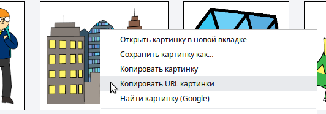
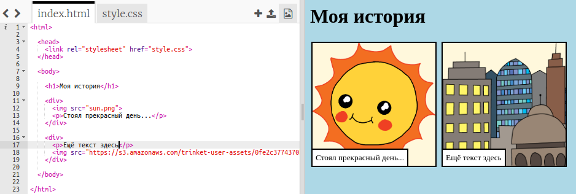

## Поиск собственных изображений

Давай найдем изображение в Интернете, чтобы добавить к твоей истории.

+ Перейди на [эту страницу](http://jumpto.cc/html-images){:target="_blank"}, и найди изображение, которое ты хочешь включить в свою историю.

+ Right-click the image, and click **Copy Image URL** (or **Copy Image Address**, depending on the computer you are using). The URL is the address of the image.

+ Go back to your `index.html` page.

+ Paste the URL between the speech marks in your `` tag. You should see your image appear!

