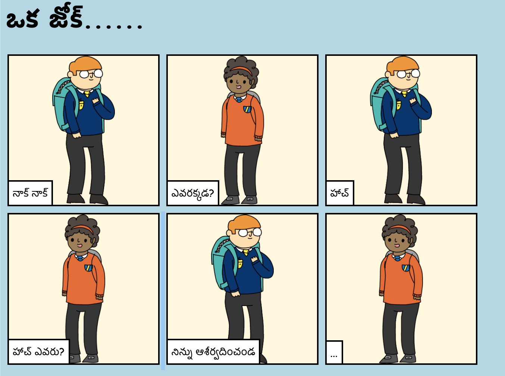

## పరిచయం

ఈ ప్రాజెక్ట్‌లో, కథ, జోక్ లేదా పద్యం చెప్పడానికి మీ స్వంత వెబ్‌పేజీని ఎలా సృష్టించాలో మీరు నేర్చుకుంటారు.

### మీరు ఏమి చేయబోతున్నారు

పంచ్ లైన్ చూడటానికి ట్రింకెట్‌లో క్రిందికి స్క్రోల్ చేయండి!

  <iframe src="https://trinket.io/embed/html/c8afdef912?outputOnly=true&start=result" width="600" height="450" frameborder="0" marginwidth="0" marginheight="0" allowfullscreen>
  </iframe>
  

### మీరు ఏమి చేయబోతున్నారు

This project covers elements from the following strands of the [Raspberry Pi Digital Making Curriculum](https://rpf.io/curriculum){:target="_blank"}:

+ [ ప్రాథమిక 2D మరియు 3D అస్సేస్ట్ డిసైన్ ](https://www.raspberrypi.org/curriculum/design/creator){:target="_blank"}.

### అధ్యాపకులకు అదనపు సమాచారం

మీరు ఈ ప్రాజెక్ట్ను ముద్రించాల్సిన అవసరం ఉంటే, దయచేసి [Printer friendly version](https://projects.raspberrypi.org/en/projects/tell-a-story/print){:target="_blank"} ఉపయోగించండి .

’en/resources’ ఫోల్డర్‌లోని అన్ని రిసోర్సెస్ (ఉదాహరణ పూర్తయిన ప్రాజెక్ట్‌తో సహా) కలిగి ఉన్న ఈ ప్రాజెక్ట్ కోసం GitHub repository యాక్సెస్ చేయడానికి ఫుటర్‌లోని లింక్‌ను ఉపయోగించండి.