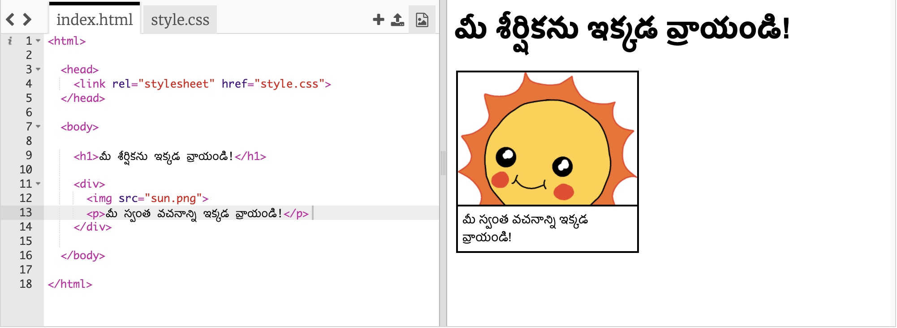
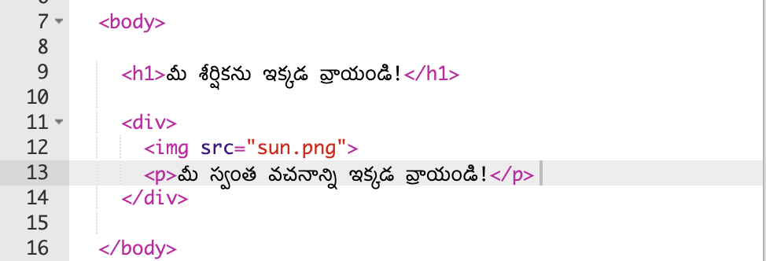
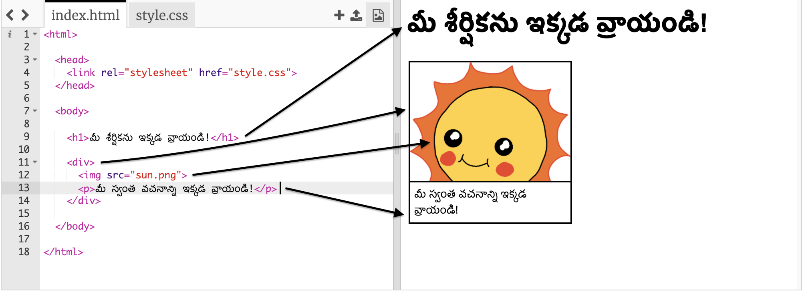

## మీ కథను మార్చడం

కథ యొక్క వెబ్‌పేజీ లో HTML కంటెంట్ మరియు CSS శైలిలో మార్పులు చేద్దాం.

+ ఈ [ట్రింకెట్](http://jumpto.cc/web-story) {:target="_blank"} ను తెరవండి.

ప్రాజెక్ట్ ఇలా ఉండాలి:

వెబ్‌పేజీ కంటెంట్ `<body>`HTML డాక్యుమెంట్ లేదా పత్ర౦ లోని `index.html` విభాగంలో ఉంటుంది.

+ వెబ్‌పేజీ కంటెంట్‌ 7వ పంక్తి నుండి `<body>`మరియు ` </body>` టాగ్లు లోపల కలదు.

+ వెబ్‌పేజీ యొక్క విభిన్న భాగాలను సృష్టించడానికి ఏ ట్యాగ్‌లు ఉపయోగించబడుతున్నాయో చూడండి.

## \--- collapse \---

## title: సమాధానం

+ `<h1>`ఒక **శీర్షిక**. విభిన్న శీర్షికలను వ్రాయడానికి మీరు 1 నుండి 6 సంఖ్యలను ఉపయోగించవచ్చు.
+ `
` సులభ౦గా **విభజన** చేయమటకు మరియు సమూహ అంశాలను కలిపే మార్గం. ఈ వెబ్‌పేజీలో, మీరు దీన్ని మీ కథలోని సమూహ భాగాలకు ఉపయోగించవచ్చు.
+ `` ఒక ** చిత్రం **.
+ `
`టెక్స్ట్**పేరా**.

\--- /collapse \---