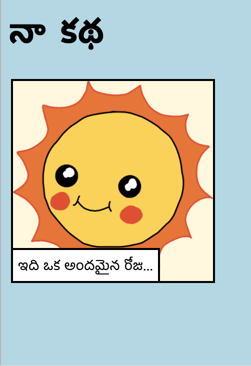

\--- challenge \---

## సవాలు: కొన్ని మార్పులు చేయండి

మీ వెబ్‌పేజీ ప్రకారం HTML మరియు CSS కోడ్‌ను మార్చండి.

HTML కంటెంట్ `index.html` ఫైల్, మరియు `style.css` CSS శైలి ఫైల్ లో చూడవచ్చు.

మీరు వెబ్‌పేజీలో ఉపయోగించిన రంగులను కూడా మార్చవచ్చు మరియు మీరు వేర్వేరు ఫాంట్‌లను ఉపయోగించవచ్చు:

+ ఏరియల్
+ కామిక్ సాన్స్ MS
+ ఇంపాక్ట్
+ తాహోమా

మరిన్ని CSS రంగుల పేర్లను[ ఇక్కడ](http://jumpto.cc/colours){:target="_blank"} ఇక్కడ చూడండి.

\--- /challenge \---