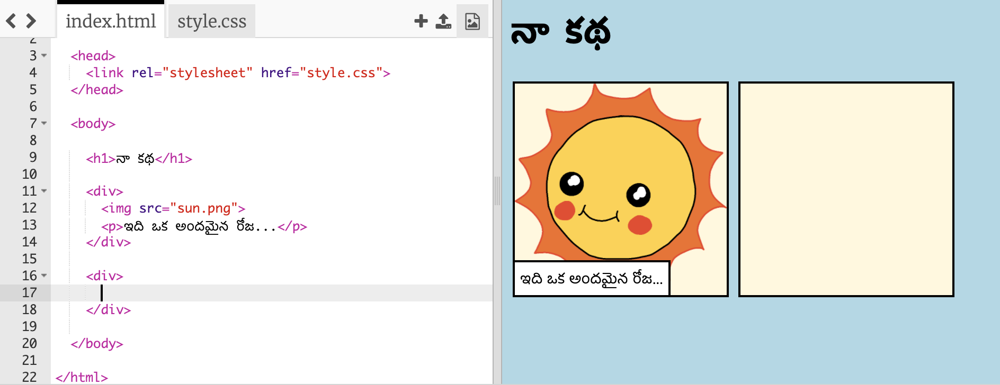
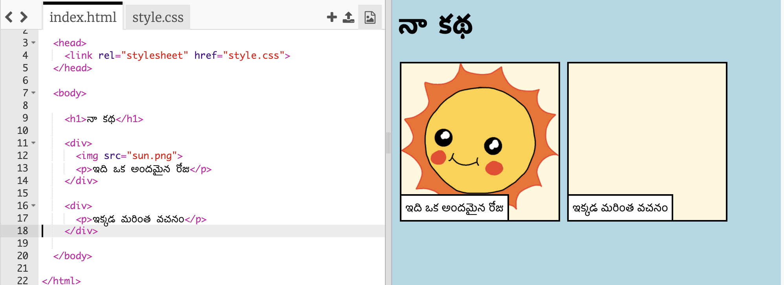
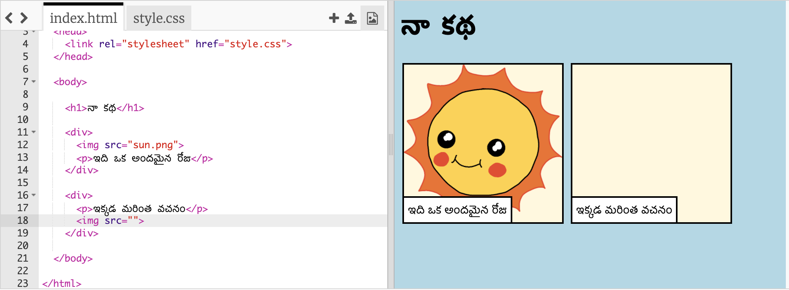
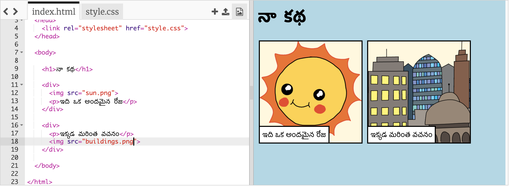

## మీ కథ చెప్పడం

మీ కథకు రెండవ భాగాన్ని చేర్చుదాం.

+ కోడ్ యొక్క 15 వ పంక్తికి వెళ్లి, `<div>` మరియు `</div>` యొక్క మరొక సెట్‌లో ప్రారంభ మరియు ముగింపు ట్యాగ్‌లను జోడించండి. ఇది మీ కథ యొక్క తరువాతి భాగం కోసం క్రొత్త పెట్టెను సృష్టిస్తుంది.



+ మీ క్రొత్త `<div>` ట్యాగ్‌లో టెక్స్ట్ యొక్క పేరాను జోడించండి:

```html
<p> ఇక్కడ మరింత టెక్స్ట్! </p>
```



+ మీ `<div>` ట్యాగ్ లోపల ఈ కోడ్‌ను జోడించడం ద్వారా మీరు మీ క్రొత్త పెట్టెలో చిత్రాన్ని ప్రదర్శించవచ్చు:

```html

```



`` ట్యాగ్‌లు ఇతర ట్యాగ్‌ల నుండి కొద్దిగా భిన్నంగా ఉన్నాయని గమనించండి: వాటికి ముగింపు ట్యాగ్ లేదు.

+ ఒక చిత్రాన్ని చూపించడానికి, మీరు **చిత్ర మూలాన్ని** (` src `) ప్రసంగం గుర్తులు లోపల జోడించాలి.

మీ కథ కోసం ఉన్న చిత్రాలను చూడటానికి పిక్చర్ బటన్ పై క్లిక్ చేయండి.


+ మీరు ఏ చిత్రాన్ని జోడించాలో నిర్ణయి౦చి దాని పేరును గుర్తుంచుకో౦డి, ఉదాహరణకు `buildings.png`.

+ మీ కోడ్‌కు తిరిగి రావడానికి `index.html`పై క్లిక్ చేయండి. 


+ మీ `` ట్యాగ్‌లోని ప్రసంగ గుర్తుల మధ్య చిత్రం పేరును జోడించండి.

```html

```

