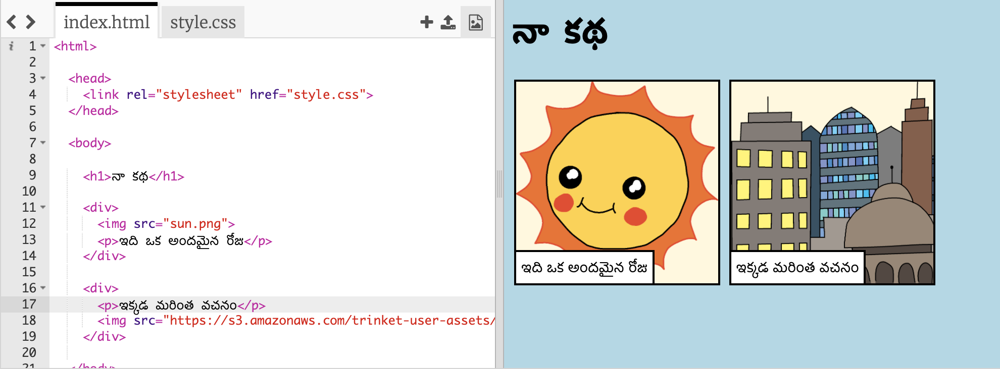

## మీ స్వంత చిత్రాల కోసం వెతుకుతోంది

మీ కథకు జోడించడానికి వెబ్‌లో ఒక చిత్రాన్ని వెతుకుదా౦.

+ [ఈ పేజీకి](http://jumpto.cc/html-images){:target="_ blank"} వెళ్ళి, మీరు మీ కథలో ఉంచాలనుకుంటున్న చిత్రం కోసం చూడండి.

+ చిత్రంపై కుడి-క్లిక్ చేసి, ** కాపీ URL ని క్లిక్ చేయండి ** (లేదా ** చిత్ర చిరునామాను కాపీ చేయండి **, మీరు ఉపయోగిస్తున్న కంప్యూటర్‌ను బట్టి). URL చిత్రం యొక్క చిరునామా.

+ మీ పేజీ కు `index.html` తిరిగి వెళ్ళ౦డి.

+ మీ `` ట్యాగ్‌లోని ప్రసంగ గుర్తుల మధ్య URL ని పేస్ట్ చేయ౦డి లేదా అతికించండి. మీ చిత్రం ఇప్పుడు మీకు కనిపిస్తు౦ది!

