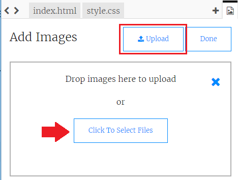

## చిత్రాలను అప్‌లోడ్ చేస్తోంది

** మీకు ట్రింకెట్ అకౌంట్ ఉంటే **, మీరు మీ స్వంత చిత్రాలను మీ వెబ్‌పేజీకి కూడా అప్‌లోడ్ చేయవచ్చు.

+ మీ ట్రింకెట్ ఉన్న చిత్రంపై క్లిక్ చేసి,**ఆడ్ ఇమేజ్** క్లిక్ చేయండి.


+ ** అప్‌లోడ్ ** బటన్‌ను క్లిక్ చేసి, ఆపై మీరు మీ కంప్యూటర్‌లో ఉపయోగించాలనుకుంటున్న చిత్రాన్ని కనుగొని బాక్స్‌లోకి లాగండి. లేకపోతే, దాన్ని క్లిక్ చేయడానికి బటన్‌ను ఉపయోగించండి.



+ అప్పుడు మీ `` ట్యాగ్‌లోని స్పీచ్ గుర్తుల మధ్య మీ క్రొత్త చిత్రం పేరును ఇలా జోడించండి:

```html

```