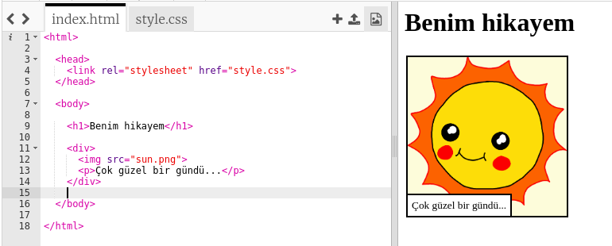
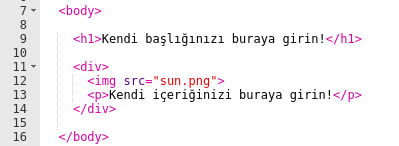
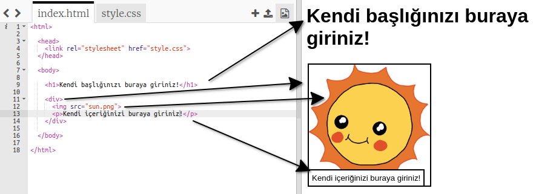

## Hikayenizi düzenleme

Hikayenin web sayfasının HTML içeriğini ve CSS stilini düzenleyerek başlayalım.

+ [Bu trinketi](https://trinket.io/html/9b69df40e3){:target="_blank"} açın.

Proje şu şekilde gözükmeli:

Web sayfasının içeriği `index.html` HTML belgesinin `<body>` bölümünde olacak.

+ Web sayfası içeriğini 7. satırdan itibaren, `<body>` ve `</body>` etiketlerinin içinde bulun.

+ Bakalım web sayfasında farklı bölümler oluşturmak için hangi etiketlerin kullanıldığını bulabilecek misiniz?

--- collapse ---
---
title: Cevap
---

+ `<h1>` bir **başlık**. Farklı boyutlarda başlıklar oluşturmak için 1'den 6'ya kadar olan sayıları kullanabilirsiniz.
+ `
`, **divison (Dilimizde bölüm gibi bir anlama geliyor)** anlamına geliyor ve yaptıklarınızı gruplara ayırmak için bir yol olarak kullanılır. Bu web sayfasında, hikayenizin her bir bölümü için tüm öğeleri bir araya getirmek için kullanacaksınız.
+ `` **resim** anlamına geliyor.
+ `
` yazınızın bir **paragraf**ıdır.

--- /collapse ---