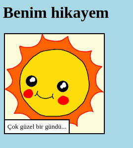

\--- challenge \---

## Meydan Okuma: bazı değişiklikler yapın

Web sayfanızı kişiselleştirmek için HTML ve CSS kodunu düzenleyin.

HTML içeriği `index.html` dosyasında ve `style.css` dosyasındaki CSS stilinde bulunabilir.

Web sayfasında kullanılan renkleri de değiştirebilir ve aşağıdakiler gibi farklı fontları kullanabilirsiniz:

+ Arial
+ Comic Sans MS
+ Impact
+ Tahoma

[Buradan](http://jumpto.cc/colours){: target = "_ blank"} CSS için renk bulabilir ve rengin CSS ismini bulabilirsiniz.

\--- /challenge \---