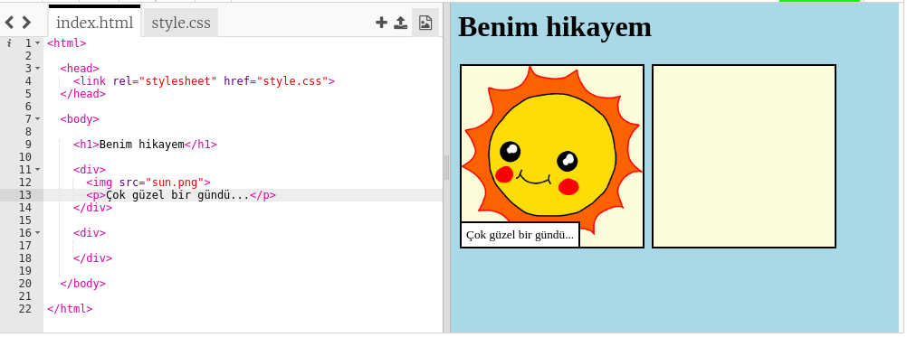
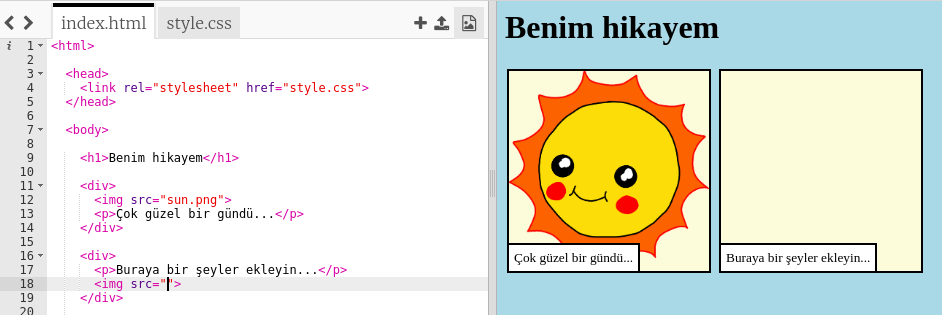

## Hikayenizi anlatma

Hikayenize ikinci bir bölüm ekleyelim.

+ Kodun 15. satırına gidin ve başka bir `<div>` ve `</div>` başlangıç ve bitiş etiketi ekleyin. Bu, hikayenizin bir sonraki kısmı için yeni bir bölüm oluşturacaktır.



+ Yeni `<div>` etiketinizin içine bir metin paragrafı ekleyin:

```html
<p>Buraya metin girilecek!</p>
```


+ Bu kodu `<div>` etiketinize ekleyerek yeni bölümünüzde bir resim görüntüleyebilirsiniz:

```html

```



`` etiketlerinin diğer etiketlerden biraz farklı olduğuna dikkat edin: son etiketleri yoktur.

+ Bir resmin gösterilmesi için, konuşma işaretlerine resmin **kaynağını** (`src`) eklemeniz gerekir.

Hikayenize uygun görüntüleri görmek için resim simgesine tıklayın.


+ Hangi görüntüyü eklemek istediğinize karar verin ve adını hatırlayın, örneğin `buildings.png`.

+ Kodunuza geri dönmek için `index.html` tıklayın.


+ Resmin adını `` etiketinizdeki konuşma işaretlerinin arasına ekleyin.

```html

```

